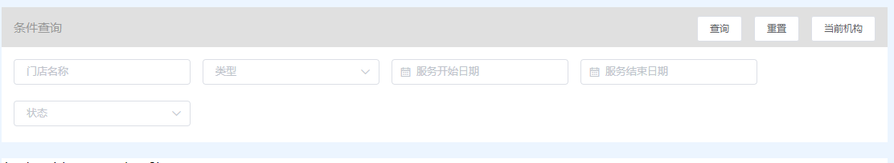

2018-08-20 开发文档
==================
##  登录注册
- 加一个验证登录 --已加

## 系统管理
- 门店管理	
 - 添加	          
    - 加一个售后热线字段（after) --已加	
    - 服务到期时间(serviceEnd) 与添加时间不一致 --无力吐槽
	- 			
 - 条件搜索 --已加
    - 约定字段
        - name
        - type 
        - start
        - end
        - state
    -  
 - 表格按钮 -- 编辑
    - 加一个接口获取单条门店信息  --已加
 - 导出表格内容 -- 缺少接口   --已加
 - 绑定公众号 ？ 待定
    
- 部门管理
  - 新增 
    - 缺少获取上级部门接口 --已加
  - 表格按钮
    - 禁用/启用接口  ---编辑接口只传state 即可

- 员工列表
  - 列表渲染缺少字段
    - 微信昵称 (nickName)  --有nickname字段 n小写
    - 所在部门
    - 每日预约是指的预约的客户姓名还是人数(若是人数默认为0)
    - 判断员工状态字段(统一以下均为state,不要一处state,一处status)
  - 新增
    - 所属部门(select复选框列表)
    - 员工角色(select复选框列表)
    - 缺少 关注用户列表接口
  -  
