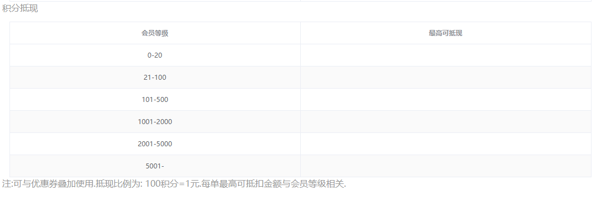

2018-08-21开发文档
==================

## 系统管理
- 平台设置
  - 会员卡等级设置
    - 添加
    - 删除
    - 编辑
  - 会员卡积分设置
    - 积分抵现列表 （缺少接口）
    - 
    - 积分消费规则 编辑 ？ （什么样，怎么做）
    - 积分消费规则 (缺少接口)
    - 消费返积分 编辑 ？ （编辑什么？）
    - 消费返积分可以编辑不能增加？？？