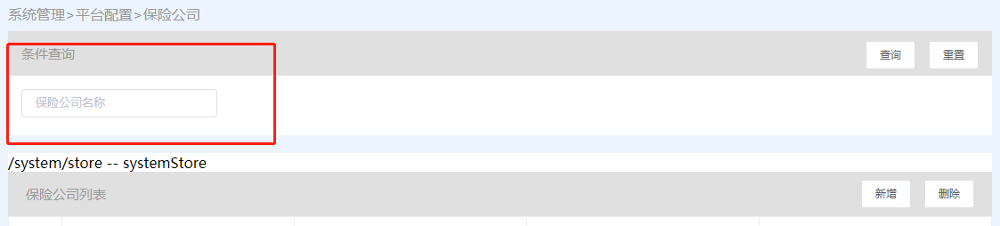
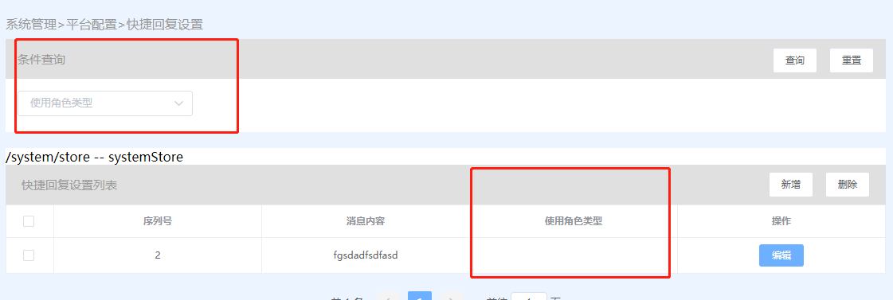
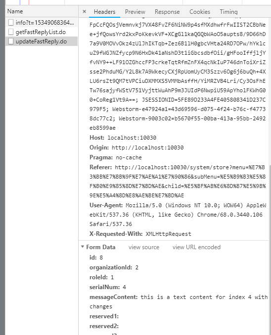
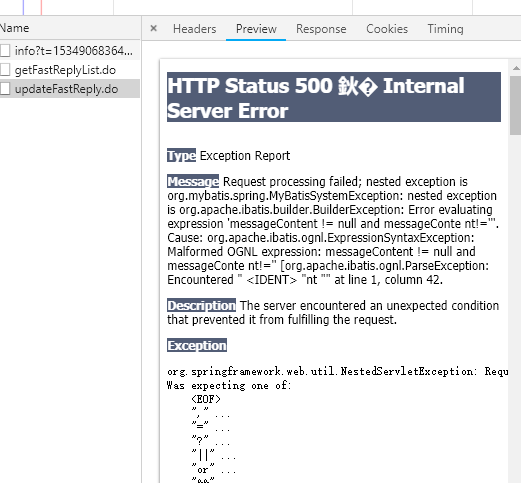

2018-08-22 开发文档
===================

## 系统管理
- 平台管理
  - 保险公司
    - 加一个关键字搜索 (keyword)
    - 
  - 快捷回复设置
    - 条件搜索 (角色类型)
    - 获取角色列表 (缺接口)
    - 
    - 编辑接口报错
    - 
    - 
  - 关注后消息推送
    - 缺少接口 (发布接口)
    - 