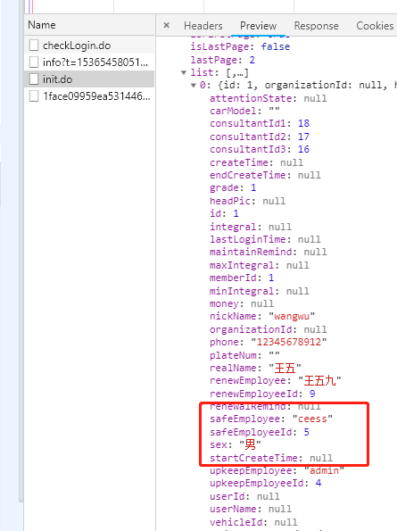
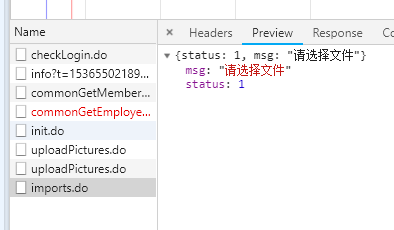
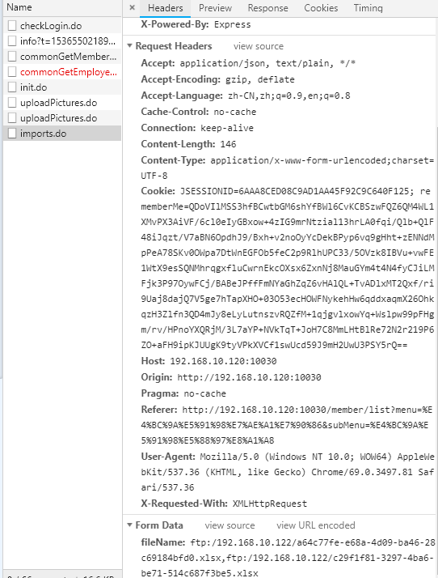
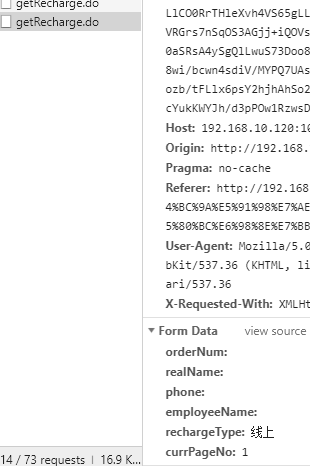
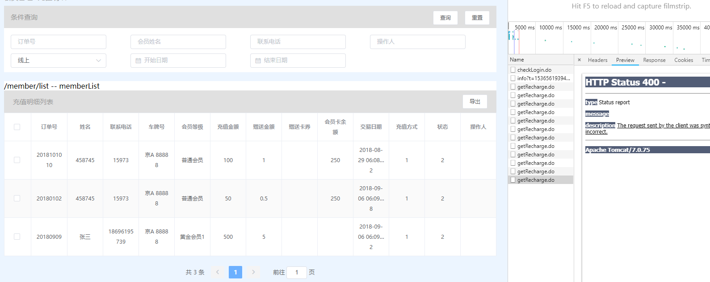
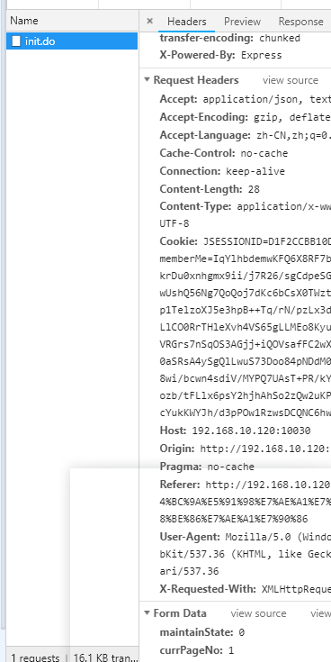
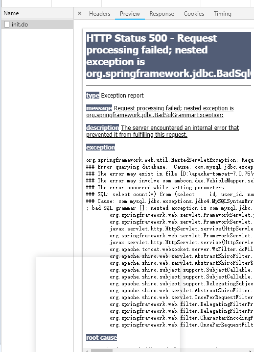
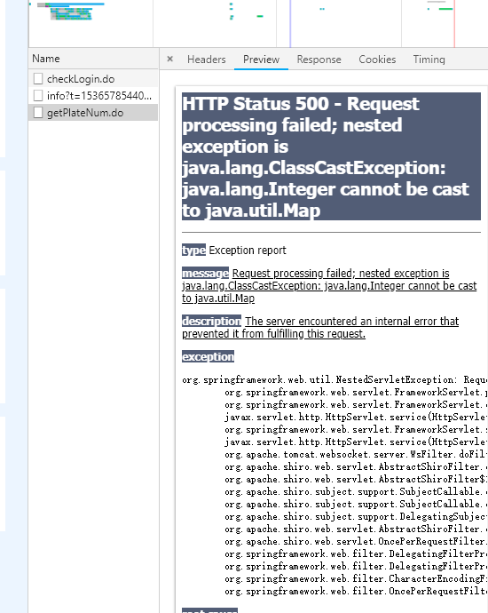

车医生后台管理系统开发文档
=======================
## 会员管理模块

### 会员列表
+ 缺少字段 -- 用户状态 -- state
+ 缺少字段 -- 最近登录时间 -- newestLoginTime      
  
+ 条件搜索 -- 会员等级搜索(任意条件搜索都没有值)
+ 导入文件      
  
  

### 会员积分管理
+ 接口报错 -- 500         
 

### 充值明细
+ 接口报错 -- 400       

### 消费明细

### 车辆管理
+ 条件搜索 -- 保养到期        
 
 

#### 会员卡

#### 订单/检查 暂时不做