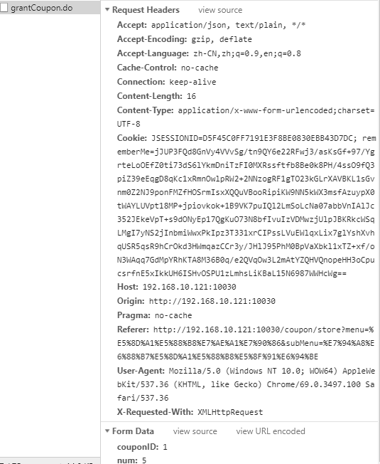

车医生 后台管理系统(卡券模块测试文档)
==================================

## 奖品卡券管理
+ 编辑奖品卡券
  + 新增奖品卡券 ,员工推荐权限roleIds
  + 编辑奖品卡券, 同样是这个员工推荐权限roleIds

+ 正常功能
  + 奖品卡券管理列表删除
  + 奖品卡券管理列表批量删除
  + 奖品卡券类型 -- 条件搜索
  + 奖品卡券名称 -- 条件搜索
  + 有效日期 -- 条件搜索

## 抽奖模板管理
+ 抽奖模板设置 
  + 设置奖项
    + 名称与奖品总数量字段为空      
           

+ 正常功能
  + 添加抽奖模板
  + 奖品名称 -- 关键字搜索
  + 删除抽奖模板
  + 模板名称 -- 关键字搜索

## 用户卡券管理
+ 用户卡券管理 
 + 卡券来源搜索 ？ 功能异常  -- 不能进行类型匹配
 + 导入 ？ 
+ 正常功能 
  + 关键字搜索
    + 姓名
    + 联系电话
    + 卡券名称
    + 卡券编号
    + 卡券类型
    + 日期rank
    + 使用状态
  + 点击核销
  + 导出
    + 默认导出
    + 条件导出

## 用户卡券发放
+ 用户卡券发放
  + 条件搜索
    + 会员等级 ？ 条件搜索数据为空
    + 销售顾问 - 保养顾问 - 保险顾问 -- 三个顾问的列表搞正常一点 ？ 条件搜索结果为空
    + 个人信息是否完善
  + 全部推送 接口500 -- coupon/grantCoupon.do     
           
             
  + 根据选中用户推送      
           
             
  + 根据条件推送        
            
             
+ 正常功能
  + 条件搜索
    + 姓名
    + 联系电话
    + 车型
    + 车牌
    + 性别
    + 个人信息与车辆信息是否完善
    
## 用户奖励
+ 用户奖励
  + 条件搜索
    + 联系电话 ？ 精确搜索？ -- 错误
    + 奖励金额
    + 活动卡券 -- select -- 接口哪一个？
+ 正常功能
  + 条件搜索
    + 姓名
    + 奖励类型
  + 导出
    + 默认导出
    + 条件导出
## 用户佣金提现
+ 正常功能
  + 精确搜索
  + 用户提现操作

## 用户提现记录
+ 正常功能
  + 条件搜索
    + 姓名
    + 联系电话
    + 车牌号
    + 提现日期rank
  + 导出
    + 默认导出
    + 条件导出
## 员工奖励
+ 员工奖励 
  + 导出 ？ 导出接口报错        
           
  + 发放 ？？ 暂定放着
+ 正常功能
  + 条件搜索
    + 姓名
    + 联系电话
    + 消费金额rank
    + 活动卡券
    + 发放状态
    + 奖励类型

车医生 后台管理系统(会员模块)
==========================
## 会员列表
+ 正常功能
  + 条件搜索
    + 姓名
    + 联系电话
    + 三个顾问
    + 状态
    + 车牌号
    + 车型
    + 日期rank
    + 积分rank
  + 分页器
  + 分配保养顾问
  + 分配保险顾问
  + 分配续保顾问
  + 新增会员
  + 
+ 待处理 
  + 条件搜索
    + 会员等级搜索 -- 各类型均为空
    + 性别 -- 搜索'女' 为空 
  + 导入
  + 编辑会员信息
     
     
     

## 车辆管理
+ 正常功能
  + 条件搜索
    + 姓名
    + 联系电话
    + 保养日期rank
    + 车牌号
    + 车型
+ 待解决
  + 条件搜索
    + 保险到期 -- 未到期 数据为空

## 积分管理
+ 待处理
  + 条件搜索
    + 微信昵称 -- 500          
              
               
    + 时间rank搜索 -- 范围搜索无效    
           
    + 会员等级 -- 500     
             
    
+ 正常功能
  + 条件搜索
    + 姓名  
    + 联系电话
    + 积分改变类型
    + 业务类型

## 会员充值
+ 接口报错 -- 500 (按照我们说好的来)
  
## 充值明细
+ 正常功能
  + 条件搜索
    + 订单号搜索
    + 会员姓名
    + 联系电话
    + 开始日期rank
  + 导出
    + 默认导出
    + 条件导出