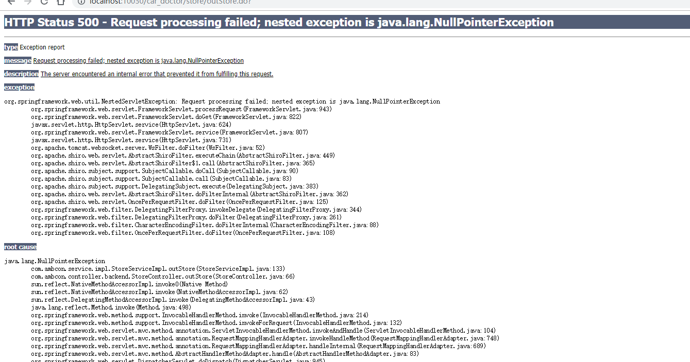
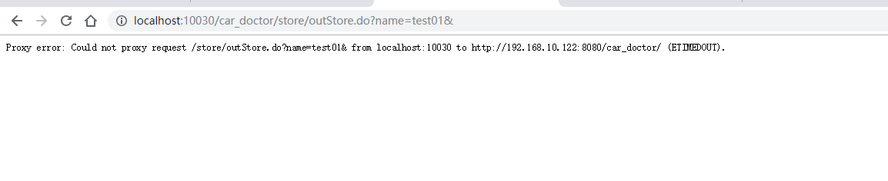
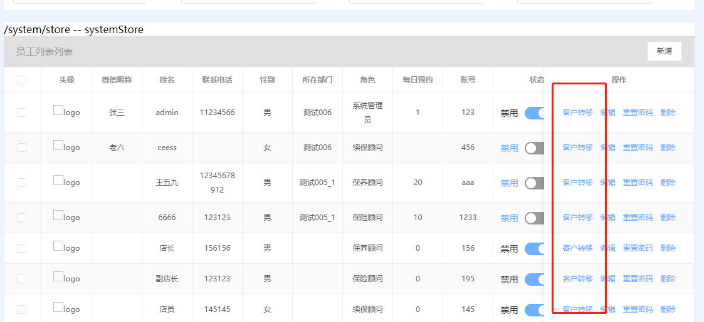

车医生后台管理系统测试文档(系统管理模块)
===================================
## 门店管理
+ 正常功能
  + 条件搜索
    + 门店名称
    + 门店类型
    + 服务时间rank
    + 门店状态
  + 编辑
+ 待解决
  + 绑定公众号
  + 导出
    + 默认导出错误 -- 500       
           
    + 条件导出 -- 代理错误
           
## 部门管理
+ 正常功能
  + 状态切换
  + 单纯编辑状态
  + 单纯编辑部门名称
  + 编辑
  + 新增
+ 待解决

## 角色管理(放着)

## 员工列表
+ 正常功能
  + 条件搜索
    + 姓名
    + 联系电话
    + 性别
    + 微信昵称
  + 删除
  + 编辑
  + 重置密码
  + 分页器
+ 待解决
  + 客户转移(待定)      
           

## 关注用户列表
+ 正常功能
  + 条件搜索
    + 姓名
    + 联系电话
    + 性别
  + 添加员工
  + 分页器 
+ 待解决
  + 条件搜索
    + 缺少微信昵称搜索
  
## 平台配置
### 会员卡等级设置
+ 正常功能
  + 新增
  + 编辑
  + 删除
+ 待解决

### 会员卡积分规则
+ 正常功能
  + 会员卡积分规则
  + 积分消费规则
  + 消费返积分规则
  + 积分抵现 

### 关注后消息推送
+ 正常功能
  + 推送

### 会员充值设置
+ 正常功能
  + 新增
  + 删除
  + 批量删除
  + 编辑
+ 待处理

### 保养提醒设置
+ 正常功能
  + 新增
  + 编辑
  + 删除
+ 待处理

### 自动回复配置
+ 正常功能
  + 状态切换
  + 编辑
  + 删除
  + 批量删除
+ 待处理

### 保险公司
+ 正常功能
  + 关键字搜索
  + 编辑新增
+ 待处理

### 快捷回复
+ 正常功能
  + 新增编辑
  + 删除
  + 
+ 待解决

车医生后台管理系统 测试文档 (用品管理)
================================
## 汽车精品管理
+ 正常功能
  + 条件搜索
    + 配件名称
    + 精品类别
    + 是否推荐
    + 积分兑换
    + 是否直降
  + 新增编辑
+ 待解决
  + 删除失败 ? 有了权限

## 精品订单管理
+ 正常功能
  + 条件搜索
    + 订单编号
    + 姓名
    + 电话
    + 配件名称
    + 订单日期rank
    + 提货日期rank
+ 待解决

### 配件大类管理
+ 正常功能 
  + 新增编辑
  + 删除
  + 批量删除