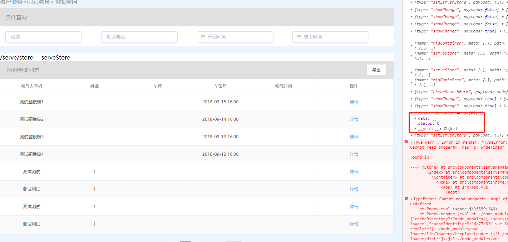

2018-10-22 车医生后台管理系统
==========================

## 客户服务

### 问卷调查
+ 编辑问卷详情 -- 缺少字段        
       
+ 明细查询返回data不对,加上分页   
       
+ 明细查询 -- 导出      
        
+ 明细查询 -- 发布      
        


## 统计分析
统计分析模块下,存在表格--图表切换,返回的数据格式期待与其一起改变。默认(加一个参数吧,dataType: 1/2/3, 1: 柱状图, 2: 折线图, 3: 普通)返回格式与普通类型一样,带上分页数据为多个对象放在list大数组中,如下:
```javascript
list:[
  {
    name:'shadow',
    age: 20,
    sex: 1
  },
  ....
]
```
图表中包含: xAxis(x轴中的元数据)期待一个数组, series(统计元数据)期待一个数组, title:为图表的标题, xAxis与series成对出现, 返回格式,如下:
```javascript
info:{
  xAxis:['2018-09-01', '2018-10-01','2018-11-01'],
  series:['10','20','30'],
  title:'图表的标题',
}
```


### 用户统计
  + 

### 车辆统计
### 业务统计
### 活动统计
### 会员统计
### 提成日报
+ 查询 -- 缺少接口
+ 
### 客户资料完整度


## 进存销

### 业务管理

### 套餐管理

### 采购管理


### 财务管理
+ 付款管理 
  + 条件搜索错误        
           
   

### 仓库管理

### 平台配置管理

### 报表管理
